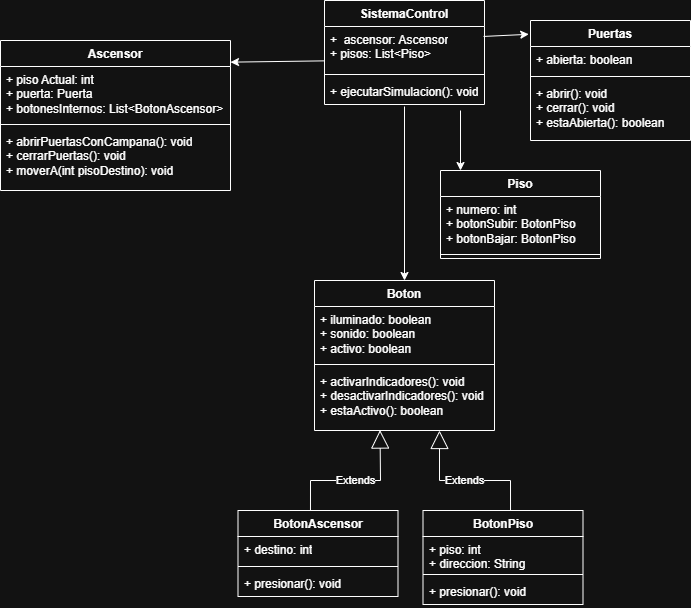

# Descripción de la solución
Se desarrolla un pensamiento selectivo sobre las decisiones que se deben realizar en un orden de ideas muy específico, dicho orden sigue la siguiente sintaxis.
1.	Usuario ubicado en el piso 1 (caso especifico) presiona el botón para subir.
2.	Boton comienza a alumbrar para avisar que el ascensor esta en funcionamiento, empezando un recorrido desde el piso 3 (caso especifico).
3.	Ascensor llega al piso 1 y suena la campana avisando que ya se encuentra en el punto, al tiempo que se apaga la luz del boton.
4.	Se abren las puertas, usuario ingresa y se cierran las puertas.
5.	Usuario selecciona el piso, botón brilla.
6.	Usuario llega al piso destino y el botón se apaga además de sonar la campana.
7.	Se abren las puertas y las puertas se cierran.

# Descripción del Proyecto

Este proyecto implementa un sistema de control de ascensor utilizando los principios de Programación Orientada a Objetos (POO) en Java.
El sistema simula el funcionamiento básico de un ascensor real:

Solicitudes desde los pisos (subir o bajar)
Selección del piso destino dentro del ascensor
Movimiento entre pisos
Indicadores luminosos y sonoros
Control de puertas
Campanas de llegada

El código fue diseñado aplicando encapsulación, herencia y composición, cumpliendo los requerimientos típicos de un sistema de elevador.

# Arquitectura del Sistema

El sistema está compuesto por las siguientes clases:

🔹 Boton (Superclase)
Gestiona la iluminación, sonido y activación de cualquier botón.

🔹 BotonPiso (Subclase)
Representa los botones ubicados en los pisos (SUBIR/BAJAR).

🔹 BotonAscensor (Subclase)
Representa los botones dentro del ascensor (piso destino).

🔹 Puerta
Controla la apertura y cierre del ascensor.

🔹 Ascensor
Contiene:
Piso actual
Puerta
Lista de botones internos
Incluye métodos para mover el ascensor, abrir puertas y activar campanas.

🔹 Piso

Contiene:
Número de piso
Botón Subir
Botón Bajar

🔹 SistemaControl

Es el coordinador general.
Maneja:
El ascensor
Los pisos
El flujo completo de la simulación

# Funcionalidades Principales
🔹 Simulación del ascensor:

Llamado desde un piso
Llegada del ascensor y apertura de puertas
Selección del piso destino
Movimiento visual del ascensor
Campana de llegada

🔹 Indicadores:

Encendido y apagado de luz en botones
Sonido de confirmación

🔹 Herencia:
BotonPiso y BotonAscensor extienden de Boton

🔹 Encapsulación:
Estados protegidos
Acceso controlado mediante métodos

🔹 Composición:

La clase Ascensor posee una Puerta
La clase Piso posee botones propios

